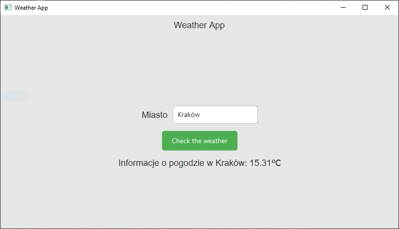

# Weather Application

A weather application written in Java that allows users to check the current weather for a selected city using the OpenWeatherMap API.

## Table of Contents

- [Screenshots](#screenshots)
- [Features](#features)
- [Requirements](#requirements)
- [Installation](#installation)
- [Usage](#usage)
- [Authors](#authors)
- [License](#license)

## Screenshots

Here is a screenshot of the application in action:




## Features

- Check weather for any city.
- Display temperature in Celsius.
- Intuitive user interface.

## Requirements

- Java 11 or higher
- Maven (optional, for dependency management)
- An OpenWeatherMap account and API key

## Installation

1. **Clone the repository:**

   ```bash
   git clone https://github.com/username/repo-name.git

2. **Navigate to the project directory:**
   ```bash
   cd repo-name

3. **Set your API key in the ApiConnection class:**
   Open the ApiConnection.java file and insert your API key where ... is indicated.


4. **Run the application:**
   If you are using Maven:
   ```bash
   mvn javafx:run

## Usage
1. Launch the application.
2. Enter the name of the city in the text field.
3. Click the "Check the weather" button to see the current weather conditions.
   
## Authors
kamil.brzoza13@gmail.com

## License
This repository is licensed under the MIT License. See the LICENSE file for details.
